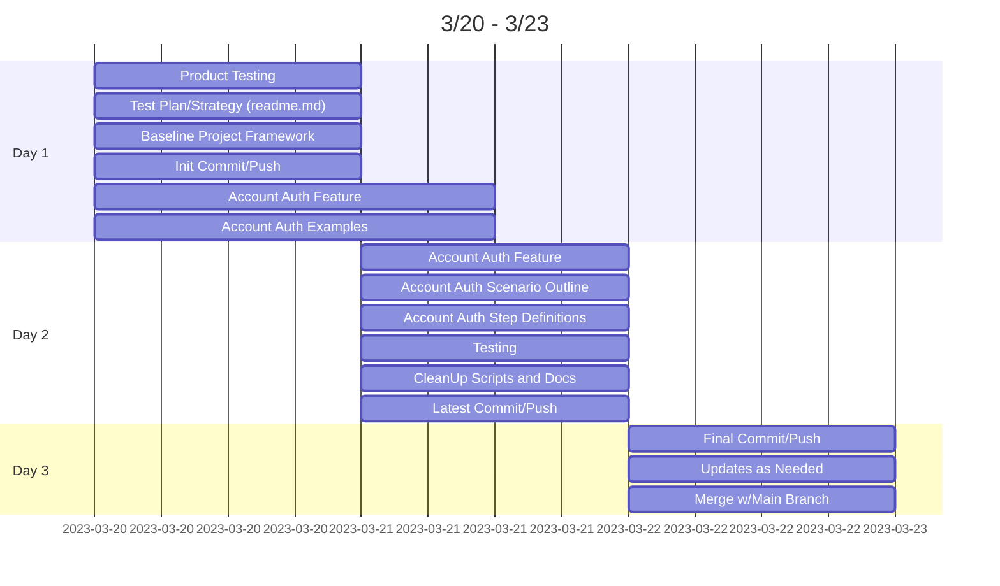
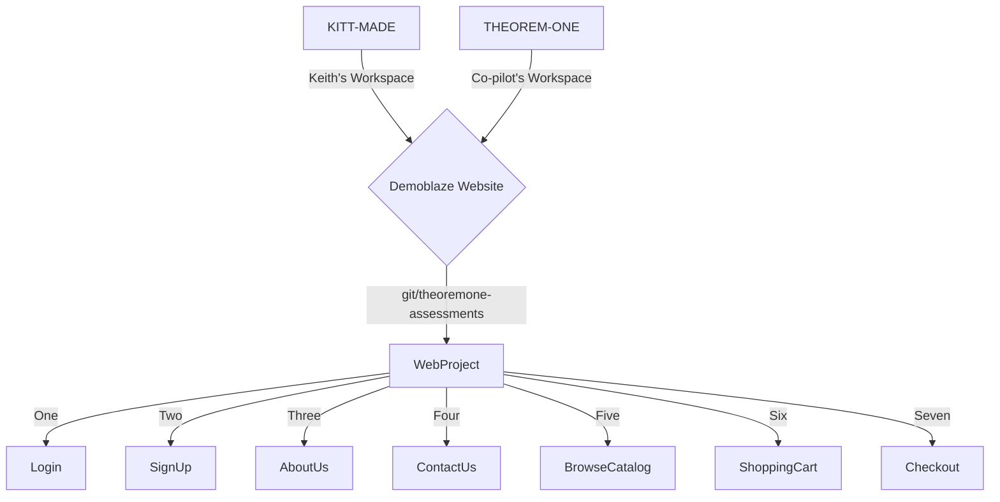

**<h1> TheoremOne Automation Project </h1>**


## <span style="color:#555555"><u> **OVERVIEW** </u></span>
Given the time constraints and specifications of the requirements, I am recommending for the focus of this 8hr project to be centered around the base project setup and design, understanding the behavioral approach to development, identifiying the overall test stratedgy, and implimenting test coverage of Account related testing only (e.g. SignUp/Login). 

While the specifications call for additional test coverage, there are descrepencies in the overall design and behavior of the application that should be discussed in more detail (noted below). 

Using the BDD methodologies to focus on the specific functionaliy of user authentification will provide a critical baseline for the overall test project design and help us to create more reliable, streamlined, and robust tests moving forward.

- [BDD Scenarios](DemoblazeUX/Scenarios)
  - [bddAuth](DemoblazeUX/Scenarios/bddAuth.feature)
- [BDD Step Definitions](DemoblazeUX/Script/Bdd)
  - [bdd_Auth](DemoblazeUX/Script/Bdd/bdd_Auth.js)
- [Common Scripts](DemoblazeUX/Script/Common/Main.js)
- [Event Handlers](DemoblazeUX/Script/Events)
- [Object Mapping](DemoblazeUX/NameMapping)
- [Support Batch Files](DemoblazeUX/Stores/Files)
- [<span style="color:gold"> VIDEO: Testrun Example MP4 </span>](../Src/testrunEX.mp4)

## <span style="color:#555555"><u> **NOTES** </u></span>
 Auth (Login/SignUp): 
- Day 1
  - Currently validating the form and not via input fields (e.g. username = null, password = valid | result = "Please fill out Username and Password" | expected = "Please fill out Username")
  - What are the acceptable values and data types needed for SignUp/Login?
  - What should occur after SignUp? 
  - Should the user be automatically logged in with the page refreshed w/profile info? 
  - Are we worried about cross-site scripting (e.g. username = ``, password = `<iframe src iframe src="javascript:javascript:alert(1)"></iframe src>`)
  - Message syntax, what verbiage should be displayed in positive/negative tests? (e.g. when user already exists, message says "This user already exist."
  - Are there any design mock-ups or elements to reference or consider?
  - How does SignUp/LogIn behvaior effect subseqent functionality around the browsing and shopping experiences?

- Day 2
  - I've decided to go ahead and map out the object references for the entire webpage, as I think this will help with build out of the tests foing forward and creates a structured and logical naming convention and organization segmentation for easier management.
  - ISSUE: Current web drivers are unable to recognize the contentText of Alert messages, so it is impossible to validate the appropriate message is displayed. (e.g. please enter username and password VS unername already exists VS signup successful) 
    - SOLUTIONS:
      - Consider handling alert messaging differently, perhaps reusing existing modal functionality to display alert messages?
      - Grant access to the Database.dbo.Users table to refresh test data on tearddown event (when the test stops) to avoid duplicate account creation and false/positive alert messages.

## <span style="color:#555555"><u> **POINTS OF CONTACT** </u></span>
When issues arise for any of the below mentioned areas, please contact the associated personnel for support and troubleshooting.
- **Anything:** Keith Hudson kitt@made.llc


## <span style="color:#555555"><u> **SPECIFICATIONS** </u></span>

* These are the areas that the client requested coverage for:
  * Account creation
  * Login
  * Browsing the store’s main categories (Phones, Laptops, Monitors)
  * Play About Us video
  * Send a message through Contact
  * Shopping cart
  * Checkout
  
* The framework and tool selection is up to you, but here are some ideas that might help the implementation to serve as an example of good practices:
  * Including a way to pass along custom data for tests where needed, as the catalog is going to be changing frequently.
  * Having comments put in place to help with the handover of the code to the client.

* Any scenarios and needs outside of what the client has requested that you feel should be included can be documented and optionally added to the automated suite, if time allows it.

* Finally, what would you do differently if you had more time? A few sentences in the README of the repository are enough.


## <span style="color:#555555"><u> **CORE SOLUTIONS** </u></span>
I've decided to leverage my access to the Smartbear automation frameworks to create the base project in TestComplete, which allows for a quick, easy, and robust solution and can be easily adopted to open-source models. [Reference](https://support.smartbear.com/testcomplete/docs/index.html)

1. TestComplete 15 – IDE & Test Runner
2. TestComplete License Manager – Activating/Deactivating Licenses
3. TestComplete Web Extension – Chromium Based Web Runner
4. SQL Server Management Studio – SQL Server DBMS
5. ODBC Data Sources (64-bit) – API for Accessing DBMS
6. Git – Distributed Version Control System


## <span style="color:#555555"><u> **TIMELINE** </u></span>

Below is a 4 DAY timeline of all completed, current, and automation efforts conducted by...well, me.




DAY 1 (3 hrs)
- **Product Testing (hands-on)** <span style="color:green"> **COMPLETE** </span>
- **Test Plan/Strategy (readme.md)** <span style="color:green"> **COMPLETE** </span>
- **Baseline Project Framework** <span style="color:green"> **COMPLETE** </span>
- **Account Auth Feature** <span style="color:green"> **COMPLETE** </span>
- **Account Auth Examples** <span style="color:green"> **COMPLETE** </span>
- **Init Commit/Push** <span style="color:green"> **COMPLETE** </span>

DAY 2 (4 hrs)
- **Baseline Project Framework** <span style="color:green"> **COMPLETE** </span>
- **DOM NameMapping** <span style="color:green"> **COMPLETE** </span>
- **Account Auth Feature** <span style="color:green"> **COMPLETE** </span>
- **Account Auth Scenario Outline** <span style="color:green"> **COMPLETE** </span>
- **Testing** <span style="color:gold"> **IN-PROGRESS** </span>
- **CleanUp Scripts and Docs** <span style="color:gold"> **IN-PROGRESS** </span>
- **Latest Commit/Push** 


DAY 3 (TBD)
- **Final Commit/Push** 
- **Updates as Needed** 
- **Merge w/Main Branch** 


## <span style="color:#555555"><u> **INFRASTRUCTURE** </u></span> 
Below is the BDD flow-chart of the Feature and Scenario Outline for testing the [https://www.demoblaze.com/](https://www.demoblaze.com/) website.



## <span style="color:#555555"><u> **BDD REFERENCES** </u></span>
- [Azure - BDD Test Case Template](https://cucumber.io/docs/gherkin/reference/)
- [Cucumber - Gherkin Reference](https://cucumber.io/docs/gherkin/reference/)
- [Cucumber - Tags Reference](https://cucumber.io/docs/cucumber/api/?lang=java#tags) 
- [TestComplete - BDD Reference](https://support.smartbear.com/testcomplete/docs/bdd/index.html) 

## <span style="color:#555555"><u> **AUTH SCENARIO EXAMPLE** </u></span>
This is a concrete example that illustrates a business rule. It consists of a list of steps. You can have as many steps as you like, but we recommend 3-5 steps per example. Having too many steps will cause the example to lose its expressive power as a specification and documentation. Each step starts with _Given, When, Then, And,_ or _But_. Each step in a scenario is executed one at a time, in the sequence you’ve written them in.

```
@Auth
Feature: bddAuth

  Background: Initial Setup 
    Given The test data has been refreshed and Browser is open and maximized
   
  @authSignUp
	Scenario: Verify Demoblaze SignUp
  	Given The user has an active session in "https://demoblaze.com/"   
    When The user navbar menu is verified
    Then The user can signup
     
  @authLogIn
	Scenario: Verify Demoblaze Login
  	Given The user has an active session in "https://demoblaze.com/"   
    When The user navbar menu is verified
    Then The user can login
    
  @authLogOut  
  Scenario: Verify Demoblaze Logout
    Given The user has an active session in "https://demoblaze.com/"   
    When The user navbar menu is verified
    Then The user can logout
    
  @authAccount
	Scenario Outline: Verify Demoblaze SignUp and LogIn
  	Given The user has an active session in <url>  
    And The user clicks the <auth> menu
    When The user enters their <email> and <password> into the <auth> form for <alert> validation
    And The <auth> button has been clicked
  	Then The user should be validated on <auth> 
    And The appropriate <alert> is displayed 
  
  # passsword are refs to the encrypted source
  @ex-authHappy
    | url                     | auth     | email           | password    | message   |
    |"https://demoblaze.com/" | "SignUp" | "kitt0"         | "password0" | "Success" |
    |"https://demoblaze.com/" | "SignUp" | "user1"         | "password1" | "Success" |
    |"https://demoblaze.com/" | "SignUp" | "user2"         | "password2" | "Success" |
    |"https://demoblaze.com/" | "SignUp" | "user3"         | "password3" | "Success" |
    |"https://demoblaze.com/" | "Login"  | "kitt0"         | "password0" | "Success" |
    |"https://demoblaze.com/" | "Login"  | "user1"         | "password1" | "Success" |
    |"https://demoblaze.com/" | "Login"  | "user2"         | "password2" | "Success" |
    |"https://demoblaze.com/" | "Login"  | "user3"         | "password3" | "Success" |

  @ex-authSad
    | url                     | auth     | email   | password    | message   |
    |"https://demoblaze.com/" | "SignUp" | "kitt0" | "password1" | "Failure" |
    |"https://demoblaze.com/" | "SignUp" | ""      | "password0" | "Failure" |
    |"https://demoblaze.com/" | "SignUp" | "kitt0" | ""          | "Failure" |
    |"https://demoblaze.com/" | "SignUp" | ""      | ""          | "Failure" |
    |"https://demoblaze.com/" | "Login"  | "kitt0" | "password1" | "Failure" |
    |"https://demoblaze.com/" | "Login"  | ""      | "password0" | "Failure" |
    |"https://demoblaze.com/" | "Login"  | "kitt0" | ""          | "Failure" |
    |"https://demoblaze.com/" | "Login"  | ""      | ""          | "Failure" |